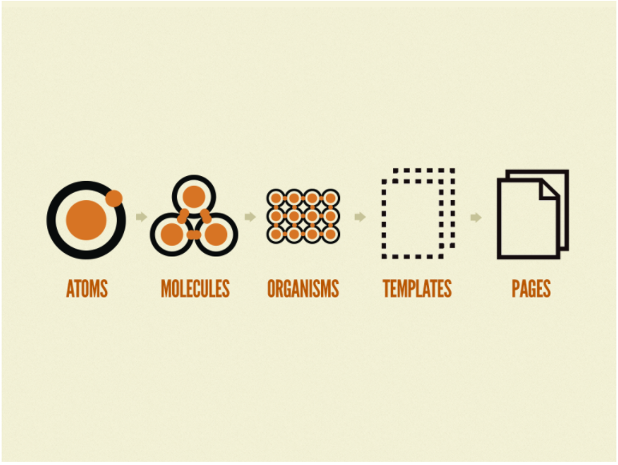
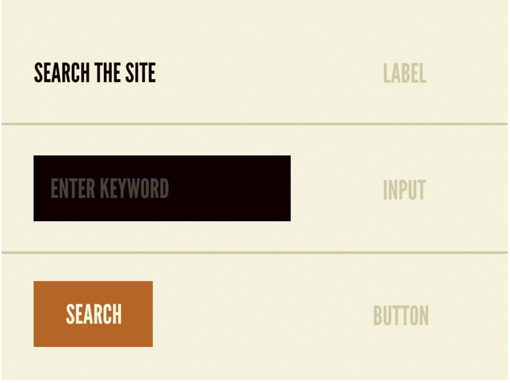
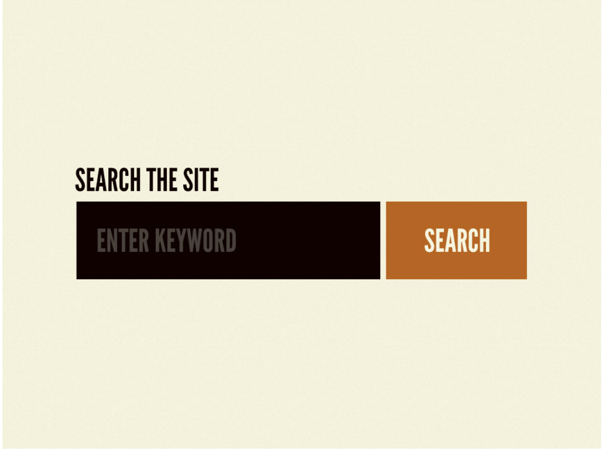
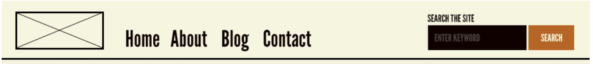
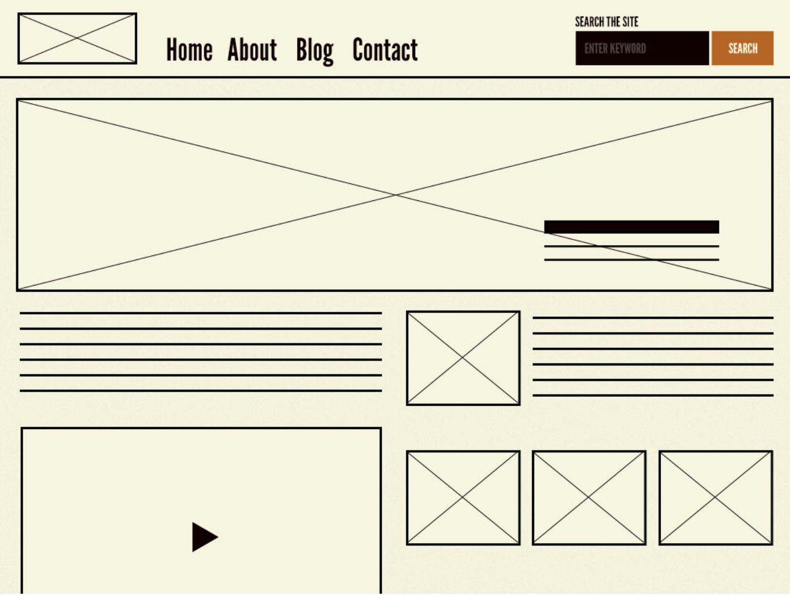
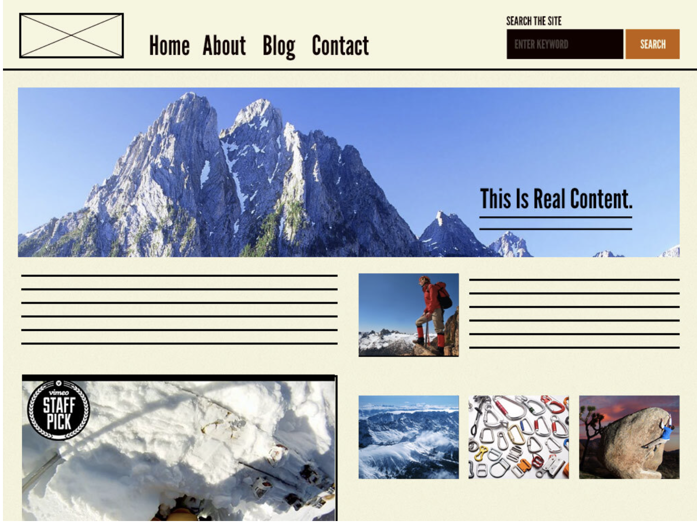

# Design System

- **_서비스의 목적에 맞게끔 일관되게 구성된 일련의 패턴(design)과 공유된 규칙(system) 언어_**
- 디자인 시스템은 디자인 원칙, 규격, 다시 사용할 수 있는 UI 패턴과 컴포넌트, 코드를 포괄하는 종합 세트
- Meterial Design, Shopify Polaris Design System

# Atomic design

### 아토믹 디자인은 디자인 시스템을 만드는 하나의 방법론으로서 5개의 단계로 나누어져 있음

- Atoms(원자)
- Molecules(분자)
- Organisms(유기체)
- Templates
- Pages

  

뷰를 Atoms -> Molecules -> Organism -> Templates -> Pages 순으로 작은 것들을 만들고 결합해서 좀 더 큰 단위의 뷰를 만드는 디자인 시스템

### Atoms

- 설계의 최소단위
- Input, Label, Button 같은 HTML의 태그나 최소의 기능을 가진 컴포넌트
- 속성의 주입이 들어갈 수 있음
- margin이나 position값을 가지고 있지 않는다.

  

### Molecules

- Atom 들을 최소의 역할을 할 수 있게 합한 그룹
- 입력을 받기 위한 Form ( Input + Label + Button )
- Atom의 위치값을 지정하기도 함

  

### Organisms

- 배치를 위한 Layout 단위로 하나의 인터페이스를 형성하는 그룹
- Header, Navigation
- Atom과 Molucule의 위치값을 지정

  

### Templates

- Organisms들의 positions, placements을 지정(Layout)
- 클래스 시스템의 클래스
- 객체의 설계도, 페이지의 설계도

  

### Pages

- 정의된 Template에 데이터를 넣어 뷰를 확인하는 단계
- 템플릿의 특정 인스턴스
- 클래스 시스템의 인스턴스, 객체의 구현체, 페이지 설계도로 그린 페이지 그 자체

  

### 장점

1. 재사용 가능한 설계 시스템을 제공

- 컴포넌트들을 혼합해 일관성 있고 재사용의 효율을 높이는 디자인을 할 수 있다.

2. 디자인을 쉽게 수정 가능

- 컴포넌트가 단위별로 이루어져 큰 컴포넌트에서 작은 컴포넌트를 삭제, 추가, 수정하는 것으로 쉽게 수정할 수 있다.

3. 레이아웃을 이해하기 쉬움

- 페이지를 처음부터 설계하는 시도가 있어, 페이지의 레이아웃의 이해가 오래가고, 팀 프로젝트 시 제 멋대로가 되는 스타일 가이드를 최소화시킬 수 있다.

### 단점

1. 오랜 기간의 디자인 설계

- 설계의 개념은 이상적이나 설계에 힘을 써야하는 장점이 오히려 단점이 된다.

2. 일관성이 떨어지는 결과 발생 위험성

- 잘못된 디자인으로 컴포넌트들을 합치고 나눌 시, 기술 부채와 개발 기간이 증대해 결국엔 일관성이 떨어지는 디자인의 결과가 발생할 수 있다.

3. 원자, 분자보다 익숙한 유기체

- 보통 사람들은 큰 단위를 정하고 그 내용물로 작은 단위를 만드는 top-down 방식에 익숙합니다. 그래서 원자, 분자부터 만드는 bottom-up이 익숙하지 않아 학습과 훈련이 필요하다.
